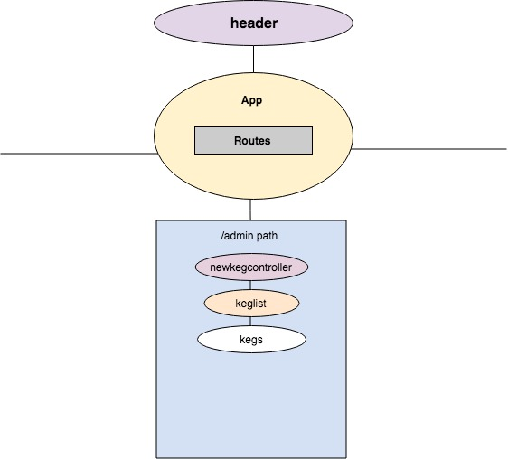

# Tap Room
#### React Fundamentals

### By Dennise Ortega

## Description
Rebuilding a project from Angular in React. The goal is to make the application with React and Angular.

## Setup
1. Clone this repository
2. type npm install in your terminal
3. After npm install is finished, type npm run start
4. navigate to http://localhost:8080/

## Workflow Diagram

## Known Bugs
none yet

## Specifications
* Patron gets to see a list/menu of all available kegs. For each keg, the patron see its name, brand, price and alcoholContent.
* Employee may fill out form when a new keg is added to the list.
* Employee may edit a keg's properties after entering them just in case.
* As a patron and employee you may see how many pints are left in a keg.

## Technologies Used
* Javascript
* JSX
* React
* CSS

## Legal
Copyright (c) 2018 Dennise Ortega
